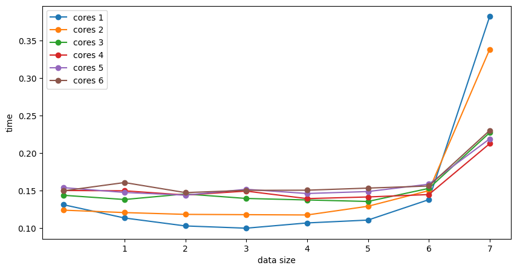
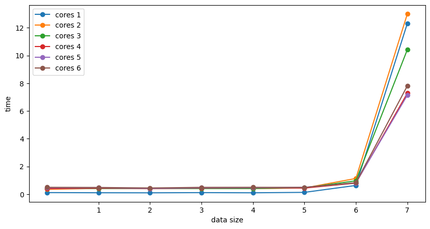

# Ulab - 1

Скрипт выполнявший замеры: [main.py](./main.py)

Компилирование исходников: 
```
mpicc -lm pi.c -o pi && \
mpicc -lm primes.c -o primes
```

Запуск исполняемых файлов:

```
mpirun -N <procs num> <path-to-executable>
```
## Программа, вычисляющая значение числа $\pi$

Исходный код представлен в файле [pi.c](./pi.c)

Результаты тестирования представлены в таблице:

|   data len |      1 core |      2 cores |      3 cores |      4 cores |      5 cores |      6 cores |
|-----------:|-------:|-------:|-------:|-------:|-------:|-------:|
|     10     | 0.1312 | 0.124  | 0.1438 | 0.1502 | 0.154  | 0.1498 |
|    100     | 0.1136 | 0.1208 | 0.1382 | 0.1498 | 0.1476 | 0.1608 |
|   1000     | 0.103  | 0.1184 | 0.1456 | 0.1442 | 0.144  | 0.1474 |
|  10000     | 0.1    | 0.118  | 0.1396 | 0.1494 | 0.1518 | 0.1504 |
| 100000     | 0.107  | 0.1176 | 0.1376 | 0.1394 | 0.1462 | 0.1506 |
|      1e+06 | 0.1108 | 0.1292 | 0.1356 | 0.1416 | 0.1488 | 0.1534 |
|      1e+07 | 0.138  | 0.15   | 0.153  | 0.1448 | 0.1586 | 0.1562 |
|      1e+08 | 0.382  | 0.3382 | 0.2272 | 0.2126 | 0.219  | 0.2302 |

График зависимости среднего времени исполнения от размера решаемой задачи при использовании разного кол-ва процессов:



## Программа, находящая кол-во простых чисел на интервале [1..N]


Исходный код представлен в файле [primes.c](./primes.c)


|   data len |       1 core |       2 cores |       3 cores |      4 cores |      5 cores |      6 cores |
|-----------:|--------:|--------:|--------:|-------:|-------:|-------:|
|     10     |  0.1154 |  0.3534 |  0.4204 | 0.3982 | 0.4616 | 0.4956 |
|    100     |  0.104  |  0.4206 |  0.4096 | 0.434  | 0.4708 | 0.4862 |
|   1000     |  0.0994 |  0.3942 |  0.4134 | 0.4158 | 0.4108 | 0.4496 |
|  10000     |  0.1132 |  0.4124 |  0.4078 | 0.4428 | 0.458  | 0.4932 |
| 100000     |  0.101  |  0.4032 |  0.4098 | 0.4754 | 0.4644 | 0.496  |
|      1e+06 |  0.1322 |  0.4484 |  0.4614 | 0.4402 | 0.4932 | 0.4892 |
|      1e+07 |  0.6308 |  1.1354 |  0.9642 | 0.7988 | 0.8226 | 0.827  |
|      1e+08 | 12.3118 | 12.9968 | 10.4216 | 7.2778 | 7.1368 | 7.8106 |

График зависимости среднего времени исполнения от размера решаемой задачи при использовании разного кол-ва процессов:



##  Вывод

Использование нескольких процессов для вычисления имеет смысл при достаточно большом объеме вычислений.
